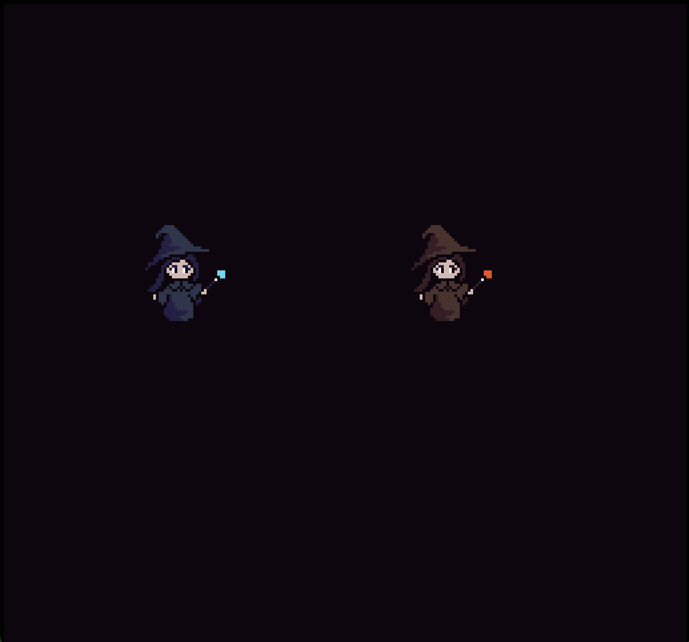

# Magical Girl Pew Pew

Author: Jingxuan Chen

## Design:
Basically a ripoff of Maiden and Spell, since I played it once and felt it was a fun party game. It is a PvP bullet hell, with each player shooting bullets and trying to hit the other player.

## Screen Shot:

## How Your Asset Pipeline Works:

The asset pipeline takes in png files and a json file with some metadata. A python file processes those inputs into a binary file that can be directly loaded into the relevant data structures in cpp. I made an intermediate Sprites class to store some data that's relevant to be able to render a multitile sprite.

<!-- (TODO: make sure the source files you drew are included. You can [link](your/file.png) to them to be a bit fancier.) -->

## How To Play:

### Player 1:
WASD to move

### Player 2:
Arrow keys to move

Ran out of time to implement shooting projectiles :(

This game was built with [NEST](NEST.md).

